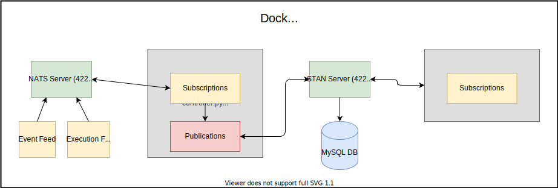

# message-broker

TODO: 
1.) Requirements are met. Describe each with documentation in the README.
2.) Create architecture diagram
3.) Email with repo and describe project/provide exctitement about using the new tech. 

---------------------
extra notes:
---------------------

Requirements:
Spec: 
1. You are given two feeds running locally, sending messages to a local NATS broker. Catalog every message with an associated timestamp into a persistent storage. These messages are serialized via protobuf (), and the spec is outlined in the repository below. 

2. Implement a subscription service that allows users to listen to both feeds in real time. The transport protocol for this service is at your discretion.

3. Ensure exactly once processing semantics for our users and persistent storage.

4. You will find the feeds, NATS broker, and protobuf specs here: https://bitbucket.org/will-sumfest/edge-swe-challenge/src/master/
5. Please let us know if you are running on a system other than MacOS or Linux.

test svg
